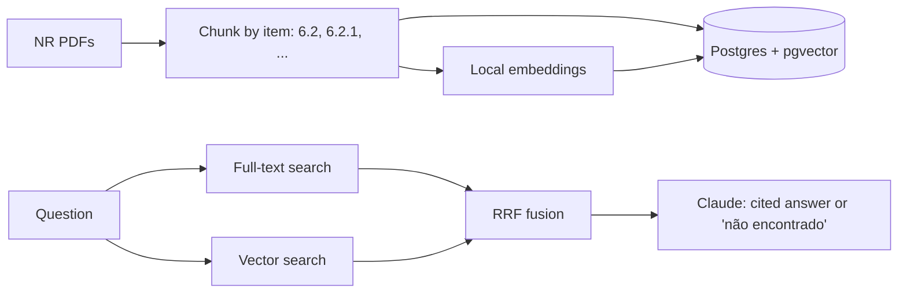

<div align="center">


[](https://github.com/vitormigli/rag-normas-regulamentadoras/actions/workflows/ci.yml)


</div>

A RAG assistant over Brazil's workplace-safety regulations (NR-01, NR-05, NR-06,
NR-17, NR-35 — real PDFs from gov.br), answering with citations to the exact
item (e.g. "NR-06, item 6.5.1") or explicitly saying "não encontrado" when the
retrieved context doesn't actually answer the question.

## Demo

```bash
docker compose up
```

Streamlit demo at `http://localhost:8501`; API at `http://localhost:8000/docs`.

## Architecture



## Results

16 gold questions (12 answerable across the 5 ingested NRs, 4 deliberately
out-of-scope — e.g. asking about insalubridade or CNH, which these NRs don't
cover). Full breakdown in [`evals/results.md`](evals/results.md).

| Metric | Value |
|---|---|
| Recall@5 — vector only | 58.3% |
| Recall@5 — hybrid (RRF) | 58.3% |
| Refusal accuracy (correctly says "não encontrado" or doesn't) | 81.2% |
| Citation accuracy (cites the expected norm) | 75.0% |

Hybrid didn't beat vector-only here — same finding as `hybrid-search-ptbr`,
now confirmed against a real Postgres/pgvector backend instead of an in-memory
index. Full-text search on its own had a concrete failure mode worth naming:
`websearch_to_tsquery('portuguese', 'EPIs obrigatórios...')` stems "EPIs" to
`'epis'`, a different lexeme than `'epi'` (from the document's "EPI"), and
since websearch mode ANDs every term, that single mismatch zeroed out the
entire result set — dense retrieval had no such problem. The 3 refusal errors
were all cases where the correct item existed in the corpus but fell just
outside the top-5 (e.g. retrieving parent item `6.2.1` instead of the child
`6.2.1.1` that actually defines "fabricante") — a retrieval-recall problem
that shows up as a generation-refusal problem, not two unrelated failures.

## Technical decisions and trade-offs

- **Chunk by the document's own item numbering**, not fixed-size windows — a
  citation like "NR-06, item 6.5.1" maps directly onto how a person would look
  it up in the real PDF. See
  [`docs/decisions/0001-chunk-by-item-number.md`](docs/decisions/0001-chunk-by-item-number.md).
- **Anon key, no RLS** — this project's entire corpus is public regulatory
  text; see
  [`docs/decisions/0002-anon-key-no-rls.md`](docs/decisions/0002-anon-key-no-rls.md)
  for why that's a scoped, documented trade-off rather than an oversight.
- **Real Postgres + pgvector (Supabase)**, not an in-memory index — this is the
  one portfolio project that needed to prove the actual production stack
  (`hybrid-search-ptbr` proves the retrieval *method* for free, locally; this
  one proves it against the real database).

## How to run

```bash
cp .env.example .env   # add ANTHROPIC_API_KEY, SUPABASE_URL, SUPABASE_KEY
uv sync
uv run python -m rag_nr.ingest_all   # one-time: chunk + embed + load into Postgres
make test   # unit tests (chunker, RRF — no DB or API calls)
make eval   # retrieval + answer-quality eval (costs real API money)
make run    # starts the API
make demo   # starts the Streamlit demo
make lint
```

## Limitations and next steps

- Only 5 of the ~38 NRs ingested, to keep PDF download/ingestion and eval cost
  manageable for a portfolio MVP — the ingestion pipeline scales to the rest
  without changes.
- No reranking step after RRF fusion yet — would directly target the
  parent-vs-child near-miss pattern found in the eval above.
- NR-01 has an annex whose own numbering restarts at `1.1`, colliding with the
  main body's numbering; the ingestion's TOC-dedup heuristic isn't guaranteed
  to always keep the main body's version. See
  [`docs/decisions/0001-chunk-by-item-number.md`](docs/decisions/0001-chunk-by-item-number.md).
- The `match_nr_chunks` Postgres function does vector search only; full-text
  search goes through PostgREST's `.text_search()` directly rather than a
  combined SQL function — two round trips instead of one, acceptable at this
  scale.

## Resumo em português

Assistente de RAG sobre Normas Regulamentadoras brasileiras (NR-01, NR-05,
NR-06, NR-17, NR-35 — PDFs reais do gov.br), respondendo com citação do item
exato (ex: "NR-06, item 6.5.1") ou dizendo explicitamente "não encontrado"
quando o contexto recuperado não responde à pergunta. Ingestão faz chunking
pela própria numeração hierárquica da norma (item → subitem), com busca
híbrida (full-text + vetorial via pgvector) num banco Postgres real (Supabase).

